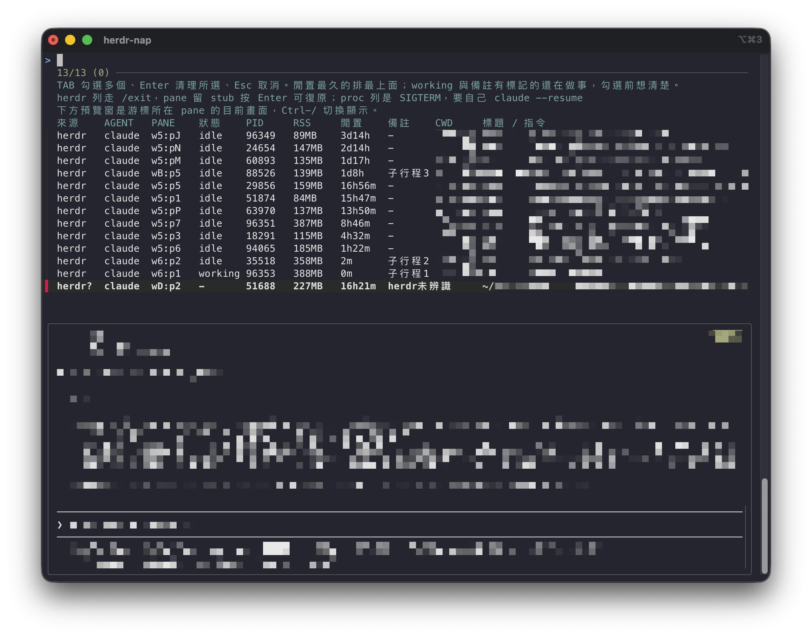

<div align="center">

# herdr-nap

[](LICENSE)
[](CHANGELOG.md)
[](https://herdr.dev/)
[](herdr-plugin.toml)
[](herdr-nap)

[English](#english) | [繁體中文](#繁體中文)



</div>

## English

Put idle [herdr](https://herdr.dev/) coding agents to sleep and wake them up where they were. herdr relaunches every parked agent on server start and never releases them (about 2 GB a day for a dozen idle `claude` sessions) and has no hibernate feature. `herdr-nap` is manual and interactive: you pick, you confirm, nothing runs on a timer.

### Install

Needs `jq` and `fzf` (`brew install jq fzf`). Then either:

```
herdr plugin install Clementtang/herdr-nap --yes     # plugin: three actions in the herdr menu
ln -s ~/herdr-nap/herdr-nap ~/bin/herdr-nap           # or run it directly
```

Both share the same state in `~/.local/state/herdr-nap/`. To update the plugin, run install again.

### Usage

```
herdr-nap            pick agents to nap (TAB multi-select, Enter, Esc)
herdr-nap --list     list only
herdr-nap --restore  bring every napped agent back
```

- **Nap**: the agent is asked to `/exit`, the pane stays, and a stub in the pane shows what was freed. **Press Enter there to resume in place**, Ctrl-C to get a shell. The pane title becomes `[nap] <original title>` while it waits.
- **Restore**: `--restore` wakes everything at once and replays the original launch flags (for example `--dangerously-skip-permissions`). If the pane is gone or holds another session, the record is kept and the command to restore elsewhere is printed. If the agent stops at a trust or permission prompt, you are told to answer it in the pane; the tool never answers for you.
- **List**: sorted by idle time (last transcript entry, not process age), RSS is the whole process tree, and a notes column flags `children:N`, `subagent-active`, `just-started`, `no-transcript`. A preview of the highlighted pane sits below the list (Ctrl-/ toggles it).
- **Pinned**: put substrings in `~/.config/herdr-nap/exclude`, one per line; agents whose pane title or tab label matches never enter the picker.
- **Outside herdr**: `claude`/`grok` started outside herdr get SIGTERM instead. Agents inside a herdr pane that herdr has not registered, and panes running `ssh`/`mosh` to another machine, are listed read-only.
- **Language**: English unless `LANG` (or `LC_ALL`, `LC_MESSAGES`) starts with `zh`; `HERDR_NAP_LANG=en|zh` overrides.

Safety: your own pane is excluded, every nap is confirmed, every exit is verified, and records are written one at a time under a lock.

### Known limitations

- Resuming with Enter starts the agent from the stub, so a custom agent name is lost; `--restore` brings it back.
- `working` agents are listed too; whether to nap them is your call.
- Idle time is only available for claude and grok.
- Agents on remote machines cannot be napped from here; run `herdr-nap` on that machine.

Maintainer notes, measurements and every trap hit along the way: [docs/internals.md](docs/internals.md).

## 繁體中文

讓閒置的 [herdr](https://herdr.dev/) coding agent 睡一下，要用時原地叫醒。herdr 在 server 啟動時會把所有 parked pane 的 agent 全部拉活且永不釋放（十幾個閒置 `claude` 一天約 2 GB），官方沒有 hibernate 功能。`herdr-nap` 是手動、互動挑選式的：你挑、你確認，沒有任何定時自動清理。

### 安裝

需要 `jq` 與 `fzf`（`brew install jq fzf`）。然後二選一：

```
herdr plugin install Clementtang/herdr-nap --yes     # plugin：herdr 選單多三個動作
ln -s ~/herdr-nap/herdr-nap ~/bin/herdr-nap           # 或直接執行
```

兩種裝法共用 `~/.local/state/herdr-nap/` 的狀態檔。plugin 要更新就再跑一次 install。

### 用法

```
herdr-nap            互動挑選（TAB 多選、Enter 清理、Esc 取消）
herdr-nap --list     只列出
herdr-nap --restore  整批復原
```

- **休眠**：對 agent 送 `/exit`，pane 保留，pane 裡留一個 stub 顯示釋放多少記憶體。**在 pane 裡按 Enter 就地復原**，Ctrl-C 回到 shell。待命時 pane 標題變成 `[nap] 原標題`。
- **復原**：`--restore` 一次叫醒全部，並帶回原本的啟動旗標（例如 `--dangerously-skip-permissions`）。pane 已關掉或被別的 session 占用時，紀錄保留並印出換 pane 復原的指令。agent 卡在信任或權限確認畫面時會提示你到 pane 回答，工具不會替你按。
- **清單**：依閒置時間排序（對話紀錄最後一筆，不是 process 年齡），RSS 是整棵 process 樹，備註欄標記「子行程N」「subagent活動中」「剛啟動」「無對話紀錄」。清單下方是游標所在 pane 的畫面預覽（Ctrl-/ 切換）。
- **釘選**：`~/.config/herdr-nap/exclude` 一行一個字樣，pane 標題或 tab 標籤含它的 agent 不進挑選清單。
- **herdr 之外**：herdr 外直開的 `claude`/`grok` 改送 SIGTERM。在 herdr pane 裡但 herdr 沒辨識成 agent 的，以及前景是 `ssh`/`mosh` 連到別台機器的 pane，唯讀列出。
- **語言**：`LANG`（或 `LC_ALL`、`LC_MESSAGES`）以 `zh` 開頭顯示繁體中文，其餘英文；`HERDR_NAP_LANG=en|zh` 可強制。

防呆：排除自己的 pane、每次休眠都確認、每個退出都驗證、紀錄逐筆在鎖下寫入。

### 已知限制

- 按 Enter 復原是由 stub 起 agent，rename 過的 agent 名稱會遺失；`--restore` 會帶回。
- working 狀態的 agent 也會列出，要不要清由你判斷。
- 閒置時間只支援 claude 與 grok。
- 遠端機器上的 agent 從這裡睡不到，請到那台跑 `herdr-nap`。

維護者筆記、實測數據與踩過的每一個坑：[docs/internals.md](docs/internals.md)。
